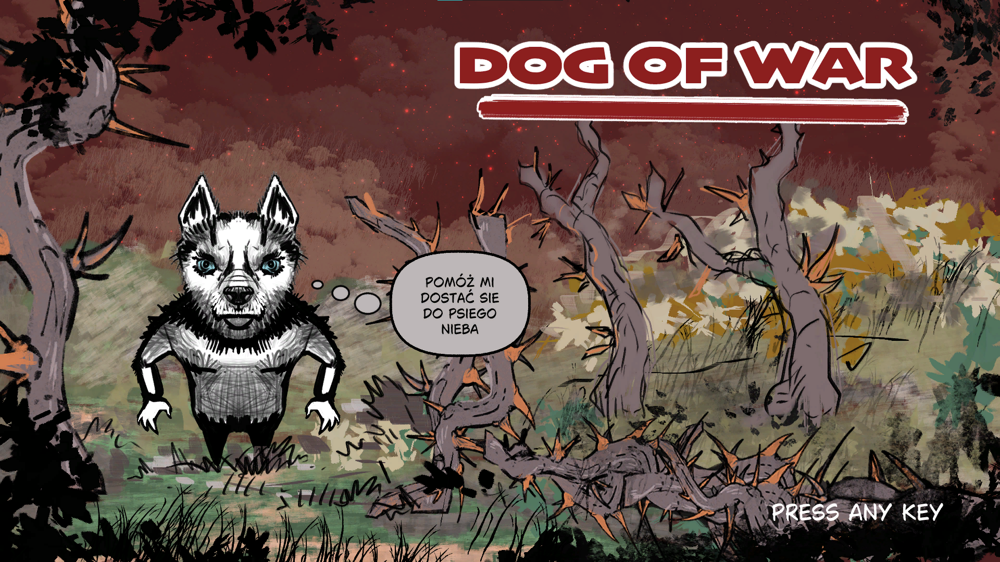
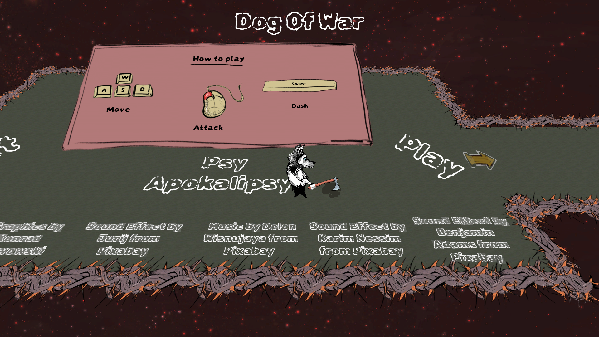
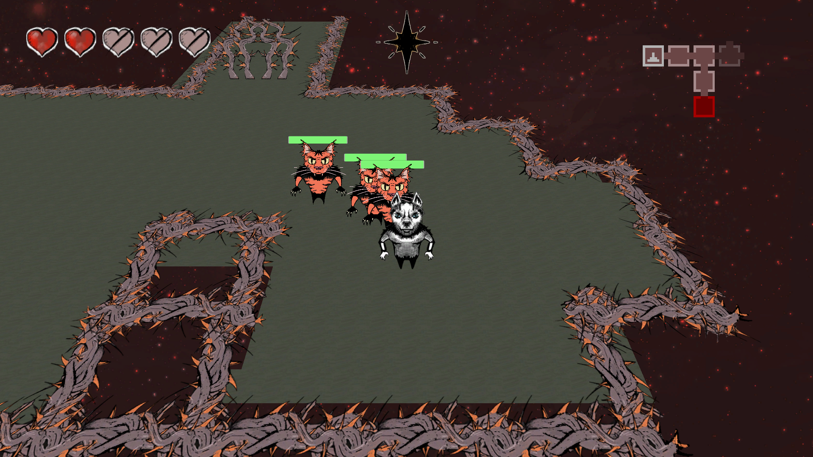

<h1 align="center">Dog of War</h1>

  

## What is it?
**Dog of War** is a game developed on Unity Engine for Komiks Game Jam 2k26 competition.\
Created in 48h for **Komiks Game Jam 2k26**\
Theme: *"Per Aspera Ad Astra"* ("Through hardships/thorns to the stars")

## Overview

**Dog of War** is a short atmospheric rougelike game. You play as a dog trapped in endless suffering, wandering through a hostile world in search of a legendary wishing star — the only thing capable of ending his torment.

## How to play?

Link: https://muppetsg2.itch.io/dog-of-war

## Gameplay

  

## Tech Stack

- Engine: Unity 6000.4.5f1

## Screenshots

  
  

## Credits

| Name | Link | Role |
|------|--------|--------|
| Marceli Antosik | https://github.com/Muppetsg2 | Map Generation Programming & Level Design |
| Patryk Antosik | https://github.com/MAIPA01 | Player & Level Behaviour Programming |
| Mikołaj Kisiel | https://github.com/Westesc | Enemies Programming |
| Konrad Karwowski | https://github.com/Darnok7 | Art Lead |

## License

### Code

The source code in this repository is licensed under the **MIT License**.

See the [LICENSE](./LICENSE) file for more information.

### Assets

All visual assets, including graphics, sprites, textures, and illustrations, are protected by full copyright and remain the property of their respective author(s).

These assets may not be reused, redistributed, modified, or used commercially without explicit permission from the author.

## Special Thanks ❤️

Thanks to everyone participating in **Komiks Game Jam 2k26** and everyone who played the game!
